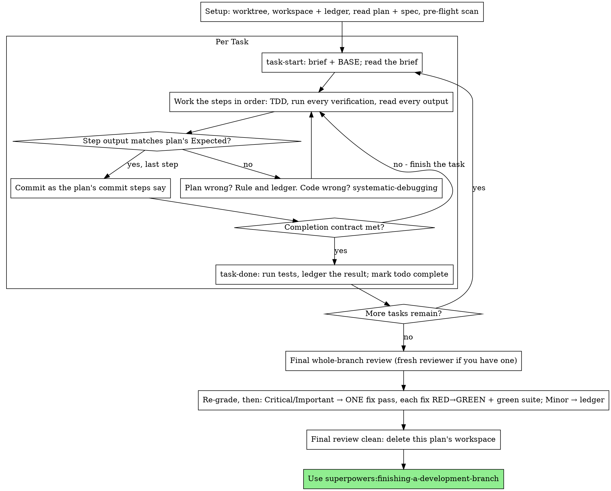

# Executing Plans

Execute the plan yourself, task by task, in this session: no implementer
subagent per task, no reviewer per task. One fresh-context review of the
whole branch at the end.

**Why inline:** Subagent-driven development pays for a fresh implementer
and a fresh reviewer on every task, each re-reading the codebase from zero.
Inline execution pays for one context (yours) plus one reviewer at the end.
What it gives up is a fresh context per task and a second pair of eyes per
task. This skill keeps what those two things bought, by other means: the
brief is the spec, the ledger is your memory, TDD is the per-task gate, and
the final reviewer is the second pair of eyes.

**Core principle:** The plan already did the thinking. Execute it exactly,
prove each step with a test you watched fail and then pass, and leave a
record that survives your own forgetting.

**Narration:** between tool calls, narrate at most one short line — the
ledger and the tool results carry the record.

**Continuous execution:** Do not pause to check in with your human partner
between tasks. They chose inline execution to spend less, not to answer
"should I continue?" after every task. Execute all tasks from the plan
without stopping.

**Rulings, not stalls.** Conflicts, ambiguities, plan defects — decide them.
The spec is the binding authority, the plan is its argument, and your
judgment settles what neither answers. Record every decision in the ledger
as `Ruling: <what you decided> — <why> — <what it costs if wrong>`, and keep
going. Deviating from the plan without a ledgered ruling is a decision made
in secret.

Four things stop you, and only these: an irreversible or destructive
operation; a security-sensitive action; a side effect outside this worktree
that norms say you ask about first (a merge, a push to a shared branch, a
publish); and a plan so broken that every path forward is a guess. For
those, stop and ask.

## When to Use

- You have a plan from superpowers:writing-plans and your human partner
  chose inline execution at the handoff.
- Your harness has no subagent tool (see the per-platform references in
  `../using-superpowers/references/`). Never fabricate a dispatch; run
  the plan here.
- Tasks are mostly independent — the same precondition as
  superpowers:subagent-driven-development.

A fully specified plan makes inline execution transcription plus testing:
it runs well on a mid-tier session model, and the one place the most
capable model earns its cost is the final review, which this skill
dispatches separately. Tell your human partner so when they choose inline.

Prefer superpowers:subagent-driven-development when your human partner
wants a review gate on every task, or when the plan is long enough that
its later tasks would run on a compacted context. Inline execution over a
long plan still works — the ledger is what makes it recoverable — but the
last tasks get the least of you.

## The Process

## Setup

Ensure the work happens in an isolated workspace: use
superpowers:using-git-worktrees to create one or verify the existing one.
Never start implementation on a main/master branch without your human
partner's explicit consent.

Conversation memory does not survive compaction. An inline executor that
loses its place re-implements tasks whose commits already exist — the same
failure as a controller re-dispatching them, paid for in your own context.
Track progress in a ledger file, not only in todos. Harness todos are a
live view; the ledger is the record.

The workspace and ledger are shared with superpowers:subagent-driven-development
— same directory, same format — so a plan can change executors mid-flight
and the new one resumes from the same ledger.

- Each plan owns a workspace: at skill start, run
  `../subagent-driven-development/scripts/sdd-workspace PLAN_FILE` — it
  prints the plan's git-ignored directory
  (`<repo-root>/.superpowers/sdd/<plan-basename>/`), home to every
  artifact for THIS plan: ledger, briefs, review packages. Another plan's
  directory is never yours to read or write.
- Check for this plan's ledger at `<workspace>/progress.md`. If its first
  line names your plan file, tasks with a `Task <N>: complete` line are
  DONE — do not redo them; resume at the first task without one. Their
  commits exist in git even when your context no longer remembers making
  them: after compaction, trust the ledger and `git log` over your own
  recollection. A ledger whose first line names a different plan file is
  another plan's progress: leave it and start your own, fresh.
- Create the ledger with its identity as the first line:
  `# SDD ledger — plan: <plan file path>`.
- `git clean -fdx` will destroy the workspace (it's git-ignored scratch);
  if that happens, recover from `git log`.

Read the plan once, note its context and Global Constraints, and create a
todo per task. If the plan names a Spec, read that too: the spec is the
authority the plan argues from, and conflicts inside the plan resolve
against it. A plan with no reachable spec gets a ledger note saying so —
rulings made without one are provisional.

**REQUIRED SUB-SKILL:** load superpowers:test-driven-development now,
before Task 1. It governs every step of every task below; a plan whose
steps already say "write the failing test first" does not exempt you
from reading it.

Before Task 1, scan the plan for conflicts between tasks. The plan's
Interfaces blocks tell you where to look: for every task that consumes
what an earlier task produces, one ledger row — the two tasks, what one
produces against what the other consumes, and what you found. Tasks that
share nothing get no row; a plan whose tasks share nothing gets the single
line `Pre-flight: no shared interfaces`. Rule on each conflict a row
surfaces with the spec as the binding authority, record the ruling beside
its row, and start Task 1. Each task's own text is checked when you read
its brief, not here.

## The Task Loop

Everything you print, and every tool result, stays resident in your
context for the rest of the session. Redirect long test output to a file
in the workspace and read its tail; read a brief, not the whole plan.

### 1. Take the task

- Run this skill's `scripts/task-start PLAN_FILE N`. It prints the brief
  path and BASE (the commit the task's range is cut from) in one call.
  Read the brief for every task, including ones you remember from setup:
  what you remember is a summary, the brief has the exact values,
  signatures, and test cases.
- Mark the task's todo in_progress.

Every tool call is a turn that re-reads your whole context. Bookkeeping
rides along with work — a ledger append in the same call as the commit,
never in a call of its own.

### 2. Work the steps

The plan's steps are already in RED-GREEN order; follow them in that
order under superpowers:test-driven-development, loaded at setup. A test
step's code is written first and run first. Watching it fail is a step,
not a formality — a test that passes before the implementation exists is
a finding about the test.

Every step that runs a command has an `Expected:` line. Run the command,
read its output, and compare. Three outcomes:

- **Matches.** Next step.
- **The code is wrong.** Use superpowers:systematic-debugging. Find the
  cause; never patch the symptom to make the step's output match.
- **The plan is wrong** — a step contradicts the spec, an interface from an
  earlier task doesn't match what this task consumes, a command that
  cannot work. Rule on the smallest change that satisfies the spec, ledger
  it as `Task <N>: Ruling: <finding> — <what you decided and why>`, and
  continue. The ruling is carried, not remembered: later tasks that touch
  the same interface read it from the ledger.

Commit as the plan's commit steps say. A task that spans several commits
is fine; BASE is what the review range is cut from, never `HEAD~1`.

### 3. The completion contract

Before a task's ledger line, all of the following are true, with evidence
in this session — not inferred from the diff looking right:

- Every test the brief names exists and ran in this task, and you read
  the output.
- The final test run for the task passed — `task-done` is that run, and
  it writes the command and result into the ledger line.
- Every `Expected:` line in the brief was compared against real output.
- Every deviation from the brief has a `Ruling:` line in the ledger.

**REQUIRED SUB-SKILL:** superpowers:verification-before-completion governs
the claim. If any item is missing, the task is not complete: finish it.

### 4. Complete the task

Run this skill's `scripts/task-done PLAN_FILE N BASE -- <test command>`
with the test command the brief names for the whole task. It runs the
tests, keeps the full output in the workspace, prints the tail, and — only
if they pass — appends the completion line to the ledger:

`Task <N>: complete (commits <base7>..<head7>, tests: <command> → <result>)`

A failing run records nothing; the task is not complete. When it records,
mark the todo complete and take the next task.

## Final Review

…(the rest of this skill is left out)